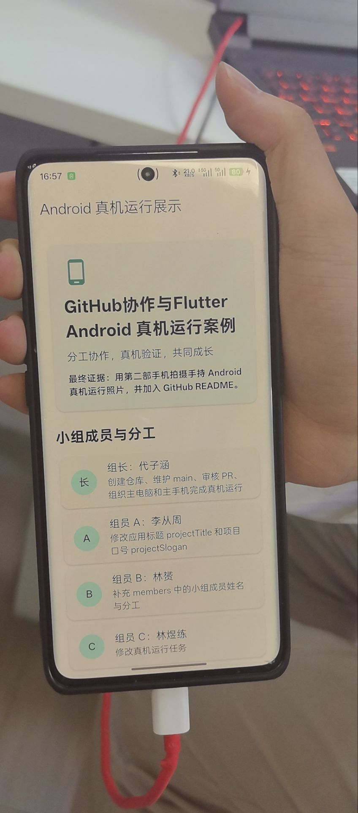

# GitHub 协作与 Flutter Android 真机运行展示

## 项目介绍

本项目是第十五周《移动应用开发》课程的 GitHub 小组协作练习。项目通过一个完整的 Flutter Android 应用案例，让每位小组成员体验从 Fork、分支修改、Pull Request 到最终合并的协作开发全流程。

应用本身是一个**小组成员分工展示页面**，运行在真实 Android 手机上，界面包含以下模块：

- **项目标题与口号** —— 展示本次协作项目的主题信息
- **小组成员与分工** —— 以卡片形式列出每位成员的角色和负责内容
- **真机运行任务清单** —— Android 设备从准备到运行的完整步骤
- **真机照片证据要求** —— 明确拍照验证的规范标准

技术栈：Flutter 3.x + Dart + Material Design 3，面向 Android 平台构建。

## 协作流程

本小组采用 **Fork + Pull Request** 协作模式：

| 步骤 | 操作 | 负责人 |
| --- | --- | --- |
| 1 | 组长创建 GitHub 原始仓库，上传项目代码 | 组长 |
| 2 | 组员 Fork 组长仓库，创建分支修改指定内容 | 组员 |
| 3 | 组员提交 Pull Request 至组长仓库 | 组员 |
| 4 | 组长审核代码并合并 PR | 组长 |
| 5 | 选定主电脑，在真实 Android 手机上运行应用 | 全组 |
| 6 | 用第二部手机拍摄真机运行照片，加入 README | 全组 |

> 组员不直接 push 组长仓库的 `main` 分支，所有修改通过 PR 进行。

## 小组成员与分工

| 角色 | 姓名 | 负责内容 | 修改文件 |
| --- | --- | --- | --- |
| 组长 | 代子涵 | 创建仓库、维护 main、审核 PR、组织真机运行 | — |
| 组员 A | 李从周 | 修改 `projectTitle` 和 `projectSlogan` | `lib/main.dart` |
| 组员 B | 林赟 | 补充 `members` 中的小组成员姓名与分工 | `lib/main.dart` |
| 组员 C | 林煜练 | 修改 `androidTasks` 真机运行任务列表 | `lib/main.dart` |
| 组员 D | 万华江 | 修改 `evidenceNotes` 证据说明 | `lib/main.dart` |
| 组员 E | 刘其凯 | 修改 README 文件 | `README.md` |

## 环境准备

从课堂下载页获取所需工具：

```text
http://10.50.2.92/course-mobile-week15/
```

下载内容：Android Studio、Flutter SDK、Android Platform-Tools、Android Command-line Tools。

> 项目路径避免中文、空格或特殊符号，建议使用短英文路径（如 `C:\dev\flutter`）。

## 运行指南

```bash
# 安装依赖
flutter pub get

# 运行单元测试
flutter test

# 查看已连接设备
flutter devices

# 指定 Android 真机运行
flutter run -d <设备ID>
```

### 真机连接检查

```bash
adb devices     # 必须显示 device，若为 unauthorized 请解锁手机并允许 USB 调试
```

手机需先开启 **开发者选项** → **USB 调试**，连接后选择 **文件传输（MTP）** 模式。

## 真机验证要求

- 必须使用真实 Android 手机运行，不能使用模拟器或 Web 截图
- 必须由第二部手机拍摄，拍到手持真机的画面
- 至少拍摄 **2 张照片**：正面展示应用界面 + 侧面展示手持真机与电脑连接
- 照片需清晰可辨认手机品牌/型号，光线充足，禁止修图处理或裁剪

## 真机运行照片

将照片保存为 `images/android-real-device.jpg`：


